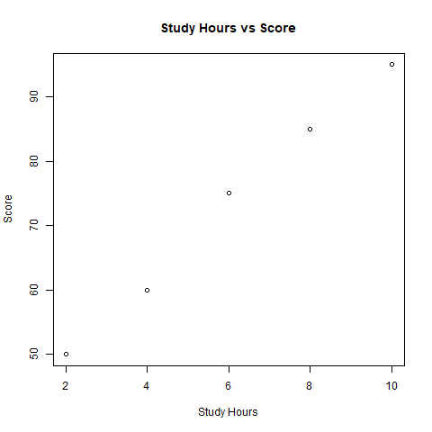

# Student Performance Analysis using R

## Description
This project analyzes student performance using R.

## Tools Used
- R language
- readxl package
- Git & GitHub

## Output Summary
The dataset was cleaned and analyzed using summary statistics and linear regression.

## Plot Output
Below graph shows the relationship between study hours and score:

